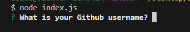

# Professional README Generator

## Description

A program facilitated by Node that allows the user to generate a full README for their project using just the command line

## Installation

Node.js required - download here: https://nodejs.org/en/download

## Usage

Walkthrough video: https://drive.google.com/file/d/1GOzhN1gx0pvub71Es62KFBnefCm72NX4/view?usp=sharing

Once node is installed, clone the repo to your system. Once clones, enter the 'starter' folder with your terminal and in your command line type

```
node index.js
```
Click enter, and the program will run, asking for a series of inputs. 



Answer these inputs based on your current project and a README will be generated within the repo folder, entitled 'ProjectREADME.md'

## License

This program operates under the MIT License
